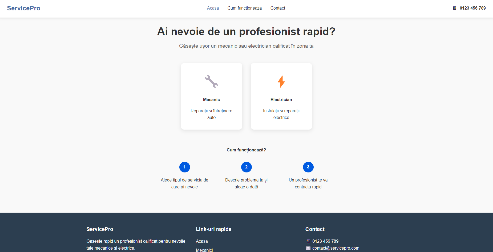
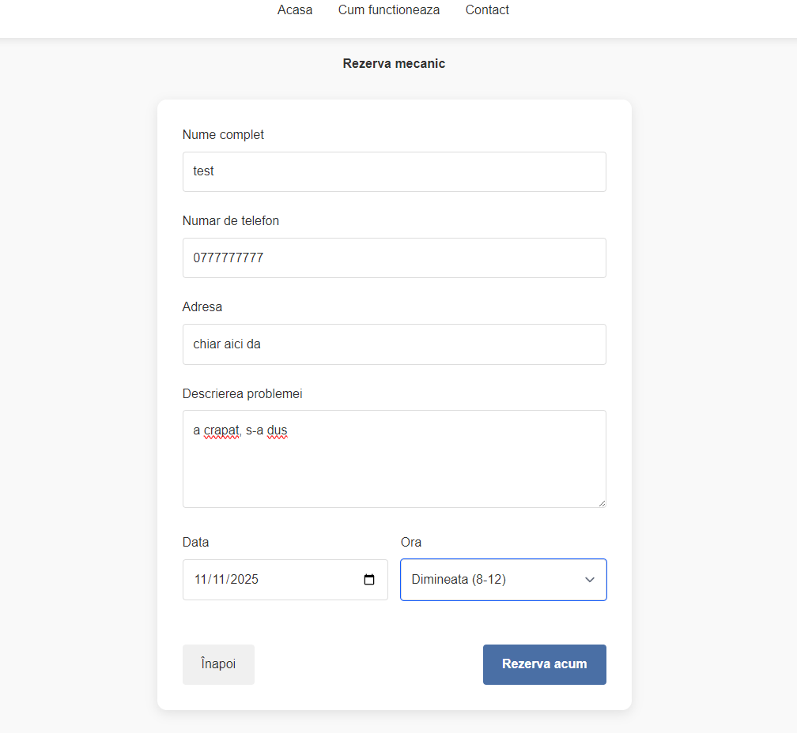

# **Specialist Finder**

Welcome to my awesome project built using **SvelteKit**! 🎉  
This project is a fully functional platform that allows users to **book appointments with specialists** and ensures that data is properly managed in a **PostgreSQL** database. Below you'll find an overview of the website's functionality and a showcase of its features!

## 🖥️ **Website Features**

### 1. **Frontend Overview**
The frontend of the site is built with **SvelteKit**, offering a smooth and modern experience for users to browse services and make bookings. The website provides an intuitive interface to:
- View available services.
- Select and book an appointment with a specialist in the chosen field.
- Confirm the appointment and proceed with booking.



### 2. **Making a Reservation (Booking)**
Users can select a service, fill out the required fields (name, phone, address, and description of the problem), and schedule an appointment. After booking, the user receives a confirmation, and the data is stored in the database.



### 3. **Database Testing with PostgreSQL**
To ensure everything works smoothly, I tested the **PostgreSQL database** to confirm that the booking information is correctly saved. Here you can see the new booking entry being added to the database via the `psql` terminal.


---

## 🚀 **Technologies Used**
- **SvelteKit**: A fast, modern framework for building web applications.
- **PostgreSQL**: A powerful, open-source relational database.
- **Node.js**: Backend server handling requests and connecting to the database.

---

## 💻 **Getting Started**

To run this project locally:

### Prerequisites
- **Node.js** (v16.x or higher)
- **PostgreSQL** installed and running locally

### Setup Instructions

1. Clone the repository:
   ```bash
   git clone https://github.com/danbaws/specialist-finder.git
   cd specialist-finder

2. Install dependencies
   ```bash
    cd frontend
    npm install  # Install frontend dependencies (SvelteKit)
    cd backend
    npm install  # Install backend dependencies (Node.js)

3. Run two terminals, one in /backend :   "node server.js"  / 2nd one in /frontend :   "npm run dev".
4. Enjoy!
